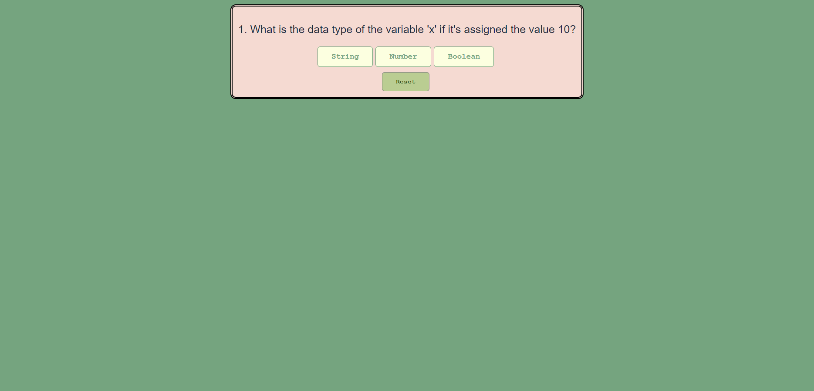
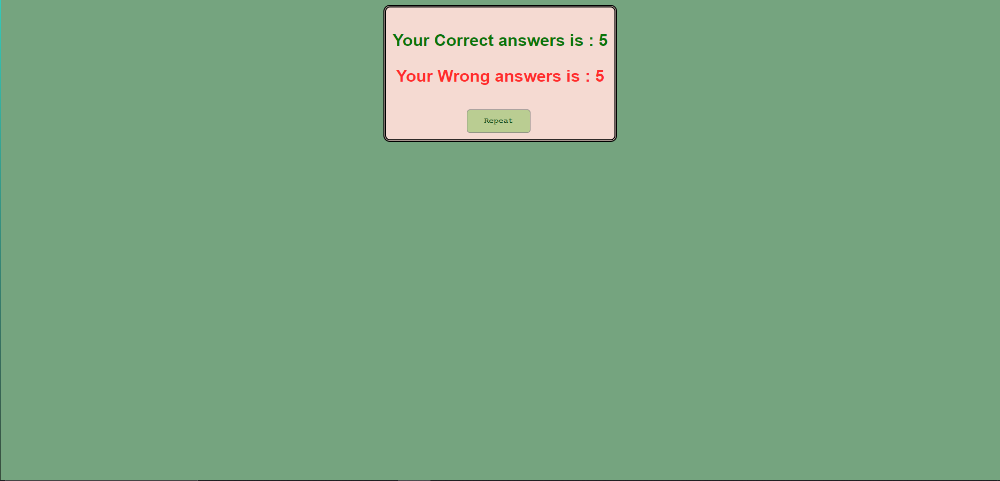

# Quiz Game

A simple React-based quiz game that tests your knowledge of programming concepts. Users can answer questions, track their scores, and reset the quiz for multiple attempts.

---



## Features

- **Dynamic Questions**: A series of multiple-choice questions with immediate feedback.
- **Score Tracking**: Tracks the number of correct and incorrect answers.
- **Reset Functionality**: Allows users to restart the quiz at any point.

---

## Technologies Used

- **React**: For building the user interface.
- **JavaScript**: For quiz logic and interactivity.

---

## Installation

1. Clone this repository:
   ```bash
   git clone https://github.com/yourusername/quiz-game.git
   ```
## How to Play
1. Answer each question by clicking on the correct answer.
2. The game will automatically move to the next question after each answer.
3. At the end of the quiz, your correct and incorrect scores will be displayed.
4. Click the Repeat button to restart the quiz or the Reset button during the game to start over.



## Future Enhancements
- Add support for more questions and categories.
- Implement a timer for each question.
- Save user progress using local storage.
